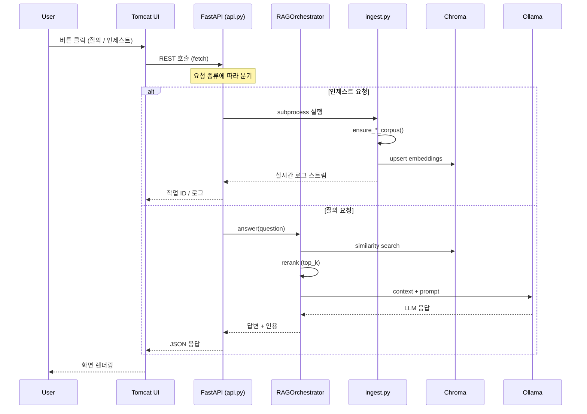

# RAG 시스템 아키텍처 (2026-01 기준 최신 소스 반영)

이 문서는 현재 리포지터리의 **FastAPI 백엔드 + Tomcat 기반 UI + Docker 서비스 스택**을 기준으로 RAG(Retrieval-Augmented Generation) 플랫폼의 구조와 데이터 흐름을 설명합니다. 주요 구성 요소는 다음 세 축으로 나눌 수 있습니다.

1. **사용자 경험 계층**: Tomcat에서 서빙되는 단일 페이지 UI(`frontend/`), RAG API를 호출.
2. **애플리케이션 백엔드**: FastAPI(`app/`) + LlamaIndex 기반 오케스트레이터가 질의·인제스트를 처리.
3. **인프라 및 모델 계층**: Chroma 벡터 스토어, Redis 작업 큐, Ollama LLM, 영구 볼륨.

## 전체 서비스 스택

| 서비스 | 컨테이너 이름 | 역할 | 아티팩트/폴더 | 호스트 포트 |
| --- | --- | --- | --- | --- |
| `api` | `rag-api` | FastAPI 백엔드. 인제스트, 질의, 설정, 상태 모니터링 API 제공. LlamaIndex, SentenceTransformers, Chroma 클라이언트 사용 | `Dockerfile`, `app/` | 8000 |
| `ui` | `rag-ui` | Tomcat 10 정적 리소스 제공. `frontend/index.html`, `app.js`, `styles.css`가 API 호출 | `docker/tomcat/Dockerfile`, `frontend/` | 8080 |
| `chroma` | `rag-chroma` | 영구 모드의 Chroma DB. 문서 임베딩을 저장·검색 | `docker/chroma/` | 8001 |
| `redis` | `rag-redis` | 비동기 인제스트 작업 상태 및 캐시 | `docker/redis/` | 6379 |
| `ollama` | `rag-ollama` | LLM 호스팅(Ollama). 기본 `qwen2.5:3b-instruct-q4_K_M` | `docker/ollama/` | 11434 |

### 볼륨 & 데이터 보존

| 호스트 경로 | 컨테이너 경로 | 용도 |
| --- | --- | --- |
| `./data/chroma` | `/data/chroma` | 벡터 스토어 영속화 |
| `./data/raw` | `/data/raw` | 소스별 코퍼스 저장 |
| `./data/models` | `/data/models` | SentenceTransformer/Hugging Face 로컬 캐시 |
| `./data/ollama` | `/root/.ollama` | LLM 가중치 |
| `./assets` | `/app/assets` | TOPIK CSV 등 정적 자산 |
| `./.env` | `/app/.env` | 런타임 설정 공유 |

## 애플리케이션 모듈 개요

| 모듈 | 핵심 기능 |
| --- | --- |
| `app/api.py` | FastAPI 라우터. 질의, 인제스트, 문서 관리, 임베딩 설정, 시스템 상태 API 제공 |
| `app/rag_orchestrator.py` | LlamaIndex 기반 질의 실행. Chroma에서 top-k 검색 → 재순위화 → Ollama 추론 → 출처/답변 생성 |
| `app/ingest.py` | CLI · 백그라운드 작업 엔트리포인트. 선택된 소스 로딩 → 청킹 → SentenceTransformer 임베딩 → Chroma 업서트 |
| `app/chunking.py` | 문서 로딩(PDF, DOCX, HWPX), 코드 블록 파싱, 청크 분할, 파일명 정규화 |
| `app/embed_config.py` | 임베딩 모델 선택/경로 검증, 오프라인 모드 전환, `.env` 업데이트 |
| `app/settings.py` | `.env`와 환경변수를 읽어 통일된 설정 객체 노출 |
| `app/ingest_history.py` | 인제스트 이력 저장 및 조회 |
| `app/topik_vocab_ingest.py` | TOPIK 기초 어휘 6천 건 CSV 처리 |
| `app/mdn_ingest.py` | MDN GitHub 압축본 다운로드/추출/필터 |
| `app/korean_dictionary_ingest.py` | DBpedia Short Abstracts + 위키낱말사전 덤프 결합, 표제어 문서 생성 |
| `app/parse_code.py` | tree-sitter 기반 코드 구조 분석 |

## API 엔드포인트

### 질의 및 상태

| 메서드 | 경로 | 설명 |
| --- | --- | --- |
| `POST` | `/rag/query` | 질문 전송, 응답/출처 수신 |
| `GET` | `/rag/status` | 시스템 헬스 및 서비스별 상태 조회 |
| `GET` | `/health` | API 준비 상태 확인 |
| `GET` | `/gpu` | CUDA/GPU 사용 가능 여부 확인 |

### 인제스트

| 메서드 | 경로 | 설명 |
| --- | --- | --- |
| `POST` | `/rag/ingest` | 선택한 소스로 인제스트 작업 시작 |
| `GET` | `/rag/ingest` | 최근/활성 인제스트 작업 상태 조회 |
| `GET` | `/rag/ingest/{job_id}` | 특정 인제스트 작업 상세 조회 |
| `POST` | `/rag/ingest/chunk-count` | 소스별 저장된 청크 개수 조회 |

### 문서 관리

| 메서드 | 경로 | 설명 |
| --- | --- | --- |
| `GET` | `/rag/documents` | 업로드된 문서 목록 조회 |
| `POST` | `/rag/documents` | 새 문서 저장 및 인제스트 트리거 |
| `GET` | `/rag/chunk-config` | 청크 관련 설정 조회 |
| `POST` | `/rag/chunk-preview` | 문서 청킹 미리보기 |

### 설정

| 메서드 | 경로 | 설명 |
| --- | --- | --- |
| `GET` | `/rag/system-prompt` | 현재 시스템 프롬프트 조회 |
| `POST` | `/rag/system-prompt` | 시스템 프롬프트 변경 |
| `GET` | `/rag/embed-config` | 임베딩 구성 조회 |
| `POST` | `/rag/embed-config` | 임베딩 모드(온라인/오프라인) 전환 |
| `GET` | `/rag/ollama-models` | Ollama 모델 목록 조회 |

### 인프라 상태

| 메서드 | 경로 | 설명 |
| --- | --- | --- |
| `GET` | `/chroma/heartbeat` | Chroma 헬스체크 |
| `GET` | `/chroma/stats` | Chroma 컬렉션 통계 |
| `GET` | `/chroma/vector-stream` | Chroma 벡터 수 실시간 SSE 스트림 |
| `GET` | `/redis/health` | Redis 연결 상태 확인 |

## 시퀀스 다이어그램

## 데이터 파이프라인 세부 흐름

### 1. 인제스트

1. 사용자(UI 혹은 CLI) → `POST /rag/ingest` (소스 목록).
2. FastAPI가 `ingest.py` 서브프로세스를 띄우고 상태를 메모리에 기록.
3. 소스별 파이프라인:
   - **TOPIK**: CSV → Pandas → 표제어/품사/예문 → `chunking.chunk_text` → 텍스트 파일.
   - **MDN**: GitHub ZIP → 필터 (영어 웹 문서) → Markdown/HTML 파싱.
   - **Korean Dictionary**: DBpedia TTL 파싱 → 위키낱말사전 XML 매칭 → 표제어별 txt 생성 → `metadata.json`.
   - **work_source/work_doc**: 로컬 폴더 스캔 → 확장자별 텍스트 추출 → 청킹.
4. 모든 소스는 SentenceTransformer(`EMBED_MODEL`)로 임베딩을 생성하고 Chroma 컬렉션에 upsert.
5. 완료 후 상태가 `succeeded`로 전환되고 UI가 로그/카운트를 갱신.

### 2. 질의

1. UI → `POST /rag/query` (질문/옵션).
2. `rag_orchestrator`가 Chroma에서 `RERANKER_TOP_K`개 컨텍스트를 검색.
3. `SentenceTransformerRerank`로 재순위화하여 `TOP_K`개 선별.
4. Ollama(`OLLAMA_HOST`)에 시스템 프롬프트 + 컨텍스트 + 사용자 질문을 전달.
5. 응답과 함께 사용된 문서 ID, 점수가 FastAPI → UI로 전달.

## Docker 이미지를 통한 배포

- **api**: 루트 `Dockerfile` (Python 3.11 slim + uvicorn). NVIDIA GPU 사용 시 `deploy.resources.reservations.devices`로 전달.
- **ui**: `docker/tomcat/Dockerfile`이 Apache Tomcat 10 + `frontend` 자산을 카피.
- **chroma**: 영구 모드(`IS_PERSISTENT=TRUE`), 메모리 제한 12GB.
- **redis/ollama**: 각각 맞춤 Dockerfile과 볼륨으로 구성.

### 의존성

- API 컨테이너는 `redis`, `chroma`, `ollama` 준비 이후 시작(`depends_on`).
- UI 컨테이너는 API가 떠 있어야 정상 동작.
- GPU 장비가 없으면 docker-compose.yml의 `deploy` 섹션을 제거하거나 수정.

## 구성 토글 & 환경 변수

### LLM 및 임베딩

| 변수 | 설명 | 기본값 |
| --- | --- | --- |
| `OLLAMA_HOST` | Ollama 서버 주소 | `http://ollama:11434` |
| `OLLAMA_MODEL` | 사용할 LLM 모델 | `qwen2.5:3b-instruct-q4_K_M` |
| `OLLAMA_NUM_CTX` | LLM 컨텍스트 크기 | `4096` |
| `OLLAMA_REQUEST_TIMEOUT` | 요청 타임아웃(초) | `240` |
| `EMBED_MODEL` | SentenceTransformer 모델 | `intfloat/multilingual-e5-base` |
| `EMBED_MODEL_ALLOW_DOWNLOADS` | 모델 다운로드 허용 | `0` |
| `EMBED_MODEL_LOCAL_PATH` | 오프라인 모델 경로 | (빈 값) |
| `SYSTEM_PROMPT` | 시스템 프롬프트 | 한국어 친절 답변 유도 |

### 검색 설정

| 변수 | 설명 | 기본값 |
| --- | --- | --- |
| `TOP_K` | 최종 반환 문서 수 | `5` |
| `MIN_RELEVANCE_SCORE` | 최소 유사도 스코어 | `0.75` |
| `RERANKER_MODEL` | 재순위화 모델 | `cross-encoder/ms-marco-MiniLM-L-6-v2` |
| `RERANKER_TOP_K` | 재순위화 전 후보 수 | `20` |

### 인제스트 설정

| 변수 | 설명 | 기본값 |
| --- | --- | --- |
| `INGEST_ALLOW_DOWNLOADS` | 원격 덤프 다운로드 허용 | `0` |
| `INGEST_BATCH_SIZE` | Chroma 업서트 배치 크기 | `4` |
| `TOPIK_VOCAB_ENABLED` | TOPIK 어휘 파이프라인 활성화 | `1` |
| `TOPIK_VOCAB_REFRESH_HOURS` | 덤프 재사용 기간 | `168` |
| `MDN_ENABLED` | MDN 파이프라인 활성화 | `1` |
| `MDN_REFRESH_HOURS` | 덤프 재사용 기간 | `168` |
| `KOREAN_DICT_ENABLED` | 한국어 사전 파이프라인 활성화 | `1` |
| `KOREAN_DICT_REFRESH_HOURS` | 덤프 재사용 기간 | `168` |

### 네트워크 및 보안

| 변수 | 설명 | 기본값 |
| --- | --- | --- |
| `API_ALLOWED_ORIGINS` | CORS 허용 오리진 (콤마 구분) | `*` |
| `RAG_API_BASE_URL` | UI가 API를 호출할 URL | (빈 값) |

## 운영 고려사항

- **데이터 정합성**: `data/raw/korean_dictionary/pages.tmp`는 빌드가 완료될 때까지 유지되며, 성공 시 `pages/`로 rename 됩니다. 중간에 중단하면 처음부터 다시 생성해야 합니다.
- **UI 표시 지표**: "지식베이스 문서 수"는 Chroma 컬렉션 내 문서 수를 불러오므로, 소스별 메타데이터와 다를 수 있습니다.
- **오프라인 환경**: `INGEST_ALLOW_DOWNLOADS=0`이면 기존 덤프가 없거나 refresh 기간이 지나도 재다운로드하지 않고 실패합니다. `EMBED_MODEL_ALLOW_DOWNLOADS=0`이면 모델 캐시가 없을 때 로드를 거부합니다.
- **확장 지점**: 새로운 소스는 `ensure_<source>_corpus()` 형태의 모듈을 추가하고 `ingest.py`에서 선택지로 노출하면 됩니다. 프론트엔드는 `frontend/app.js`의 소스 리스트만 추가하면 UI에 반영됩니다.

---

이 문서는 `frontend/`, `app/`, `docker-compose.yml` 최신 상태를 기반으로 작성되었습니다 (2026-01 기준). 변경이 있을 경우 Docker Compose와 해당 모듈 주석을 먼저 갱신한 뒤 본 문서를 업데이트하세요.
