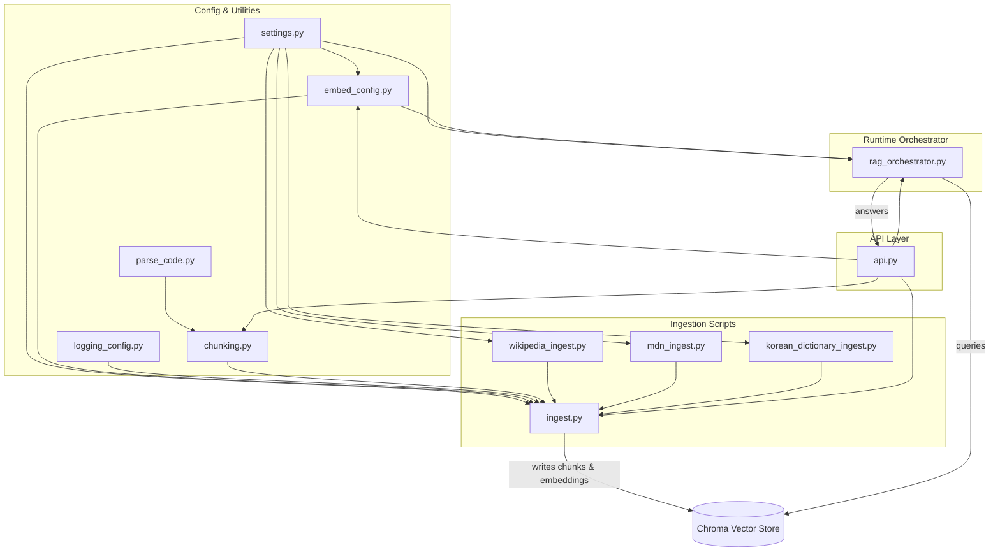
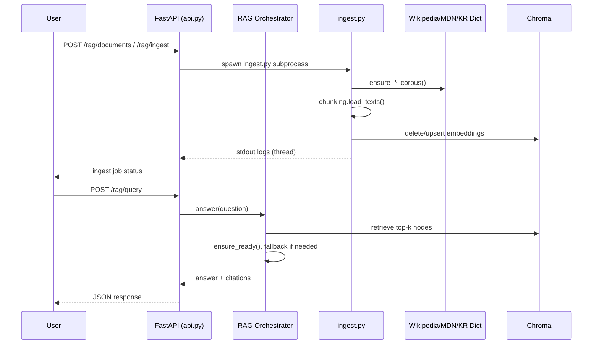

# RAG 백엔드 아키텍처 개요

이 문서는 FastAPI 기반 RAG(Retrieval-Augmented Generation) 백엔드의 11개 핵심 모듈(`api.py`, `chunking.py`, `embed_config.py`, `ingest.py`, `korean_dictionary_ingest.py`, `logging_config.py`, `mdn_ingest.py`, `parse_code.py`, `rag_orchestrator.py`, `settings.py`, `wikipedia_ingest.py`)이 수행하는 역할과 상호작용 방식을 정리한다.

## 전체 구조

시스템은 크게 **설정·로깅**, **코퍼스 준비(ingestion)**, **임베딩/검색 오케스트레이션**, **API 계층**의 네 부분으로 나뉜다. 아래 다이어그램은 주요 구성 요소와 데이터 흐름을 요약한다.

## 구성 요소별 책임과 인터페이스

| 파일 | 핵심 책임 | 주요 의존성 | 외부에서 제공하는 기능 |
| --- | --- | --- | --- |
| `settings.py` | 환경 변수 기반 런타임 설정 상수 정의 | `os.environ` | 전역 상수 (예: `OLLAMA_MODEL`, `CHROMA_HOST`, `KOREAN_DICT_*`) |
| `logging_config.py` | 공통 로깅 포맷/필터 적용 | `logging`, `logging.config`, `logging.json` | `setup_logging()`으로 구조화 로깅 초기화 |
| `embed_config.py` | 임베딩 모델 경로/모드 관리, `.env` 갱신 | `settings.py`, Hugging Face 캐시 | 설정 로드/저장, 오프라인 모드 제어, 모델 존재 검증 |
| `parse_code.py` | tree-sitter를 이용한 코드 블록 추출 | `tree_sitter` | `parse_code_blocks()`로 코드 청크 메타데이터 산출 |
| `chunking.py` | 원시 텍스트를 청크화하고 메타데이터 구성 | `parse_code.py` | `load_texts()`, `chunk_text()`, `sanitize_filename()`, `get_raw_data_dir()` |
| `wikipedia_ingest.py` | 위키백과 덤프를 로컬 코퍼스로 준비 | `chunking`, `settings`, `httpx`, `mwparserfromhell` | `ensure_wikipedia_corpus()`로 데이터 유효성 검사 |
| `mdn_ingest.py` | MDN 문서 아카이브 다운로드/정리 | `chunking`, `settings`, `httpx` | `ensure_mdn_corpus()` |
| `korean_dictionary_ingest.py` | 한국어 사전 데이터를 정규화 | `chunking`, `settings` | `ensure_korean_dictionary_corpus()` |
| `ingest.py` | 모든 소스를 청크화 후 임베딩 생성, Chroma에 업서트 | 위 세 인제스터, `chunking`, `embed_config`, `settings`, `SentenceTransformer`, `chromadb` | CLI `main()`으로 파이프라인 수행 |
| `rag_orchestrator.py` | LlamaIndex 기반 질의 파이프라인 구성 및 실행 | `embed_config`, `settings`, `llama_index`, `httpx` | `answer()`, `ensure_ready()`, `list_ollama_models()` 등 API용 래퍼 |
| `api.py` | FastAPI 엔드포인트 제공, 백엔드 상태 관리 | `rag_orchestrator`, `embed_config`, `chunking`, `ingest.py`, `settings` | `/rag/query`, `/rag/ingest`, `/rag/embed-config` 등 REST API |

## 세부 상호작용 설명

### 1. 설정 및 공통 유틸리티 계층

- **`settings.py`**는 모든 모듈이 공유하는 런타임 설정을 중앙집중식으로 정의한다. 인제스트 스크립트와 오케스트레이터는 `CHROMA_*`, `OLLAMA_*`, `INGEST_*`, `WIKIPEDIA_*`, `MDN_*`, `KOREAN_DICT_*` 등의 상수를 참조해 네트워크 접근, 데이터 경로, 새로 고침 간격을 제어한다.【F:app/settings.py†L1-L47】
- **`logging_config.py`**는 `ingest.py`가 실행될 때 호출돼 공통 로깅 포맷과 `RequestIdFilter`를 적용한다. 이를 통해 인제스트 스레드/프로세스 로그가 FastAPI에서 수집되어 `/rag/ingest` 응답으로 전달된다.【F:app/logging_config.py†L1-L24】
- **`embed_config.py`**는 임베딩 모델 선택 로직을 캡슐화한다. FastAPI API와 인제스트 파이프라인 모두 이 모듈을 통해 오프라인 모드 환경 변수를 구성하고, 로컬 모델 경로 검증, `.env` 업데이트, 캐시 탐색 등의 작업을 수행한다.【F:app/embed_config.py†L1-L204】
- **`chunking.py`**는 문서 청크화와 메타데이터 생성을 담당한다. 인제스트 파이프라인은 `load_texts()`를 호출하여 청크 텍스트 및 코드 블록 메타데이터를 얻고, API는 업로드 미리보기(`/rag/chunk-preview`)와 파일명 정규화에 활용한다.【F:app/chunking.py†L1-L125】【F:app/api.py†L403-L456】
- **`parse_code.py`**는 Tree-sitter 쿼리로 코드 블록을 추출하고 `chunking.py`에서 이를 호출해 코드 전용 메타데이터(언어, 심볼, 라인 범위)를 부여한다.【F:app/parse_code.py†L1-L172】

### 2. 데이터 인제스트 파이프라인

1. **전처리 소스 준비**
   - `ingest.py`는 옵션에 따라 위키백과(`wikipedia_ingest.py`), MDN(`mdn_ingest.py`), 한국어 사전(`korean_dictionary_ingest.py`) 모듈을 지연 로딩한다. 각 모듈의 `ensure_*_corpus()` 함수는 설정을 검증하고 코퍼스 디렉터리를 준비한다.【F:app/ingest.py†L25-L124】【F:app/wikipedia_ingest.py†L1-L118】【F:app/mdn_ingest.py†L1-L198】【F:app/korean_dictionary_ingest.py†L1-L172】
   - 위 모듈들은 `settings.py`의 경로/활성화 플래그를 사용해 로컬 자료가 존재하는지, 다운로드가 허용되는지 판단하며 필요 시 예외를 발생시켜 파이프라인을 중단한다.【F:app/mdn_ingest.py†L23-L99】【F:app/korean_dictionary_ingest.py†L31-L94】

2. **청크 생성 및 메타데이터 수집**
   - `ingest.py`는 `chunking.load_texts()`로 RAW 디렉터리 내 지원 확장자를 순회하며 텍스트/코드 청크와 메타데이터를 생성한다.【F:app/ingest.py†L149-L207】
   - 코드 파일의 경우 `parse_code.py`가 반환한 블록 단위 메타데이터(심볼, 라인 범위)를 포함해 검색 결과의 인용 정보에 활용된다.【F:app/chunking.py†L34-L101】

3. **Chroma 적재 및 갱신**
   - `ingest.py`는 SentenceTransformer 모델을 `embed_config.resolve_embedding_source()`로 로드해 청크를 임베딩한다. 업서트 전 기존 메타데이터를 경로별로 비교해 변경된 문서만 재처리하며, 삭제된 파일은 `collection.delete(where={"path": path})`로 정리한다.【F:app/ingest.py†L209-L304】
   - 임베딩 로딩 과정에서 `embed_config.ensure_offline_mode()`가 오프라인 설정을 적용하고, FastAPI API에서 변경된 임베딩 설정을 반영할 때는 `reload_embeddings()`를 호출해 오케스트레이터 캐시를 초기화한다.【F:app/ingest.py†L222-L243】【F:app/api.py†L155-L201】

4. **명령줄 및 API 트리거**
   - `ingest.py`는 단독 실행 시 CLI 인자 `--source`로 특정 소스만 인제스트하도록 지원한다.【F:app/ingest.py†L121-L147】
   - FastAPI의 `/rag/ingest` 엔드포인트는 `_start_ingest_job()`으로 새로운 백그라운드 스레드를 생성해 `subprocess`로 `ingest.py`를 실행하며, 표준 출력 로그를 수집하여 작업 상태를 추적한다.【F:app/api.py†L90-L253】【F:app/api.py†L457-L515】

### 3. 질의 오케스트레이션

- **`rag_orchestrator.py`**는 Chroma 벡터 저장소, Hugging Face 임베딩, Ollama LLM을 연결한다. `ensure_ready()`는 `embed_config`를 통해 임베딩 모델 소스를 결정하고 `ChromaVectorStore` 및 `VectorStoreIndex`를 구성한다.【F:app/rag_orchestrator.py†L1-L118】
- `query()`는 검색 상위 k개의 노드 점수를 확인해 최소 유사도(`MIN_RELEVANCE_SCORE`)에 미달하면 Fallback 응답을 생성하고, 그렇지 않으면 LlamaIndex 응답에서 인용 정보를 추출해 반환한다.【F:app/rag_orchestrator.py†L120-L274】
- FastAPI는 모듈 수준 래퍼(`answer`, `ensure_ready`, `get_chroma_heartbeat`, `list_ollama_models`, `set_system_prompt`, `reload_embeddings`)를 호출해 오케스트레이터 상태를 제어한다.【F:app/rag_orchestrator.py†L346-L374】【F:app/api.py†L52-L220】

### 4. API 계층과 상태 관리

- **`api.py`**는 FastAPI 인스턴스를 생성하고 애플리케이션 상태에 RAG 준비 여부, 인제스트 작업 목록, 스레드 핸들 등을 저장한다. 서버 시작 시 `ensure_ready()`를 호출해 오케스트레이터를 초기화한다.【F:app/api.py†L34-L133】【F:app/api.py†L256-L314】
- 주요 엔드포인트:
  - `/rag/query`: 사용자 질문을 RAG 오케스트레이터로 전달하고 응답/인용을 반환한다.【F:app/api.py†L315-L340】
  - `/rag/ingest` 및 `/rag/ingest/{jobId}`: 인제스트 작업 실행/상태 조회, 로그 스트리밍을 지원한다.【F:app/api.py†L457-L515】
  - `/rag/chunk-preview`: 업로드 문서를 서버에 저장하기 전 청크 결과를 미리 보여준다.【F:app/api.py†L403-L433】
  - `/rag/embed-config`: 임베딩 모델 모드를 온라인/오프로 바꾸고 `.env`를 갱신한다.【F:app/api.py†L206-L253】
  - `/rag/system-prompt`: 시스템 프롬프트 조회/갱신 시 오케스트레이터를 재초기화한다.【F:app/api.py†L183-L205】
  - `/health`, `/chroma/heartbeat`, `/rag/ollama-models`: 외부 서비스 상태를 프록시해 운영 지표를 노출한다.【F:app/api.py†L341-L402】
- 문서 업로드(`/rag/documents`) 시 새 파일을 `chunking.sanitize_filename()`을 통해 저장하고, 즉시 인제스트 작업을 재사용하거나 새 스레드를 시작해 최신 임베딩을 유지한다.【F:app/api.py†L434-L456】

### 5. 데이터 및 제어 흐름 요약

## 운영 고려 사항

- **오프라인 모드**: `embed_config.ensure_offline_mode()`가 다운로드 금지 시 Hugging Face/Transformers 환경 변수를 설정하며, FastAPI에서 임베딩 구성을 바꾸면 `rag_orchestrator.reload_embeddings()`를 통해 즉시 반영된다.【F:app/embed_config.py†L14-L75】【F:app/api.py†L206-L253】
- **병렬 인제스트 제어**: `_start_ingest_job()`은 락을 사용해 동시에 하나의 `ingest.py` 프로세스만 실행되도록 보장하고, 기존 실행 중인 작업을 재활용할지 여부를 호출자가 결정할 수 있다.【F:app/api.py†L214-L280】
- **인용 품질**: 코드 청크에 부여된 `is_code_block`, `language`, `symbol`, `start_line` 메타데이터는 오케스트레이터의 `_collect_citations()`이 풍부한 근거 정보를 구축해 프론트엔드에 코드 스니펫으로 표시할 수 있게 한다.【F:app/chunking.py†L34-L101】【F:app/rag_orchestrator.py†L275-L346】

## 결론

이 구조는 설정/유틸리티 모듈을 공통 기반으로, 인제스트 스크립트가 원시 코퍼스를 유지하고 오케스트레이터가 LlamaIndex·Chroma·Ollama를 통해 질의를 처리하며 FastAPI가 모든 운영 제어와 사용자 API를 제공하도록 계층화되어 있다. 각 모듈은 명확한 책임 경계를 갖고 있으며, 설정 변경이나 인제스트 트리거가 즉시 오케스트레이션 계층에 반영되도록 상호 호출을 설계하였다.
