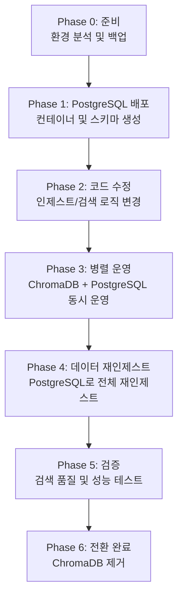

# RAG 시스템 고도화 제안서 업데이트 계획

## 개요

현재 `tobe_proposal.html`을 **ChromaDB → PostgreSQL + pgvector** 마이그레이션을 중심으로 재정비하고, 효율적인 고도화 우선순위에 따른 Phase 1~6 실행 계획과 향후 확장 가능한 아키텍처를 제안합니다.

---

## 고도화 우선순위 및 Phase 재정의

### 우선순위 결정 기준
1. **즉시 효과**: 적용 후 바로 체감할 수 있는 개선
2. **기반 기술**: 후속 Phase의 전제 조건이 되는 기술
3. **난이도 대비 효과**: 투입 대비 높은 ROI
4. **확장성**: 향후 고급 기능 도입을 위한 기반

---

## 개발자 역할 및 책임 정의

| 개발자 | 역할 | 핵심 책임 | 주 작업 범위 |
| --- | --- | --- | --- |
| a 개발자 | 백엔드 | 데이터 저장/검색, API, 인제스트, 인프라 기반 | PostgreSQL/pgvector, 검색 API, 파이프라인, 보안/로그 |
| b 개발자 | 프론트 | 사용자 경험, 화면 설계, 대시보드 | 대화형 UI, 스트리밍 응답 UI, 검색 필터, 대시보드 |
| c 개발자 | ML | 임베딩/LLM 최적화, 프롬프트, 평가 | 모델 업그레이드, 프롬프트 표준화, 검색 품질 평가 |

---

## Phase 재정의 (순서 변경 및 기간 재표기)

> 기간 표기는 주/월 대신 **단기/중기/장기**로 재정의합니다. 구체 일정은 통합 일정 수립 시 산정합니다.

| 재정의 Phase | 주요 목표 | 의존성 | 담당 개발자 |
| --- | --- | --- | --- |
| Phase 1 | PostgreSQL + pgvector 마이그레이션 | 선행 없음 | a 개발자 |
| Phase 2 | 하이브리드 검색 구현 | Phase 1 | a 개발자 + c 개발자 |
| Phase 3 | LLM 성능 최적화 + 스트리밍 API | Phase 2 | c 개발자 + a 개발자 |
| Phase 4 | UX 기반 고도화 (멀티턴, 스트리밍 UI, 피드백) | Phase 3 | b 개발자 |
| Phase 5 | 데이터 파이프라인/메타데이터 확장 (실시간 인덱싱, OCR/표 추출) | Phase 1~3 | a 개발자 + c 개발자 |
| Phase 6 | 엔터프라이즈/고급 RAG (RBAC, 감사, Agentic/GraphRAG) | Phase 3~5 | a 개발자 + c 개발자 |

### 재정의 이유 요약
- **Phase 4(UX)**를 **Phase 5(파이프라인)**보다 앞에 배치하여 사용자 피드백을 조기에 확보합니다.
- **Phase 5**는 메타데이터/고급 전처리 기반이므로 **Phase 1~3 안정화 이후** 진행합니다.

---

## Phase 실행 계획 표 업데이트 방향

- `tobe_proposal.html`의 **Phase 실행 계획** 표에 **담당 개발자** 컬럼을 추가합니다.
- 각 Phase의 핵심 실행 계획 문구를 **재정의 순서**에 맞게 수정합니다.
- 기간 표기는 **단기/중기/장기**로 통일합니다.

### 표 반영 예시

| Phase | 우선순위 | 담당 개발자 | 핵심 실행 계획 | 기간 |
| --- | --- | --- | --- | --- |
| Phase 1 | 최우선 | a 개발자 | PostgreSQL 배포 → 스키마 생성 → 전체 재인제스트 → ChromaDB 제거 | 단기 |
| Phase 2 | 최우선 | a 개발자, c 개발자 | pgvector + tsvector 하이브리드 검색 → 가중치 튜닝 | 단기 |
| Phase 3 | 높음 | c 개발자, a 개발자 | 모델 업그레이드 → SSE 스트리밍 API → 프롬프트 표준화 | 단기 |
| Phase 4 | 중간 | b 개발자 | 멀티턴 UI → 스트리밍 UI → 피드백 수집 | 단기~중기 |
| Phase 5 | 중간 | a 개발자, c 개발자 | FileWatcher 인덱싱 → 메타데이터 확장 → OCR/표 추출 | 중기 |
| Phase 6 | 장기 | a 개발자, c 개발자 | RBAC/감사 로깅 → Agentic RAG → GraphRAG | 장기 |

---

## Phase 1: 벡터 DB 마이그레이션 (PostgreSQL + pgvector)

### 우선순위: ⭐⭐⭐⭐⭐ (최우선)
**이유**: 모든 후속 고도화의 기반이 되는 핵심 인프라 변경

### 실행 계획

#### 1.1 PostgreSQL + pgvector 환경 구축
```yaml
# docker-compose.yml 추가
postgres:
  image: pgvector/pgvector:pg16
  container_name: rag-postgres
  environment:
    POSTGRES_USER: rag
    POSTGRES_PASSWORD: ${POSTGRES_PASSWORD}
    POSTGRES_DB: rag_db
  volumes:
    - ./data/postgres:/var/lib/postgresql/data
  ports:
    - "5432:5432"
  healthcheck:
    test: ["CMD-SHELL", "pg_isready -U rag -d rag_db"]
    interval: 10s
    timeout: 5s
    retries: 5
```

#### 1.2 스키마 설계
```sql
-- pgvector 확장 활성화
CREATE EXTENSION IF NOT EXISTS vector;

-- 문서 청크 테이블
CREATE TABLE document_chunks (
    id UUID PRIMARY KEY DEFAULT gen_random_uuid(),
    content TEXT NOT NULL,
    embedding vector(768),  -- multilingual-e5-base 차원
    
    -- 메타데이터
    source_type VARCHAR(50) NOT NULL,
    file_path TEXT,
    file_name VARCHAR(255),
    chunk_index INTEGER,
    content_hash VARCHAR(64),
    
    -- 전문 검색용 (tsvector)
    content_tsv tsvector GENERATED ALWAYS AS (
        to_tsvector('simple', content)
    ) STORED,
    
    -- 타임스탬프
    created_at TIMESTAMP DEFAULT CURRENT_TIMESTAMP,
    updated_at TIMESTAMP DEFAULT CURRENT_TIMESTAMP
);

-- 벡터 검색 인덱스 (IVFFlat - 대규모 데이터에 적합)
CREATE INDEX idx_embedding_ivfflat ON document_chunks 
    USING ivfflat (embedding vector_cosine_ops) WITH (lists = 100);

-- 전문 검색 인덱스 (GIN)
CREATE INDEX idx_content_tsv ON document_chunks USING GIN (content_tsv);

-- 메타데이터 인덱스
CREATE INDEX idx_source_type ON document_chunks (source_type);
CREATE INDEX idx_file_path ON document_chunks (file_path);
CREATE INDEX idx_content_hash ON document_chunks (content_hash);
```

#### 1.3 인제스트 파이프라인 수정
- `app/ingest.py`: ChromaDB 클라이언트 → psycopg2/asyncpg 클라이언트
- `app/rag_orchestrator.py`: Chroma 검색 → PostgreSQL 벡터 검색

#### 1.4 마이그레이션 절차
```
1. PostgreSQL 컨테이너 배포
2. 스키마 및 인덱스 생성
3. 인제스트 코드 수정 및 테스트
4. 기존 ChromaDB 데이터 삭제
5. PostgreSQL로 전체 재인제스트
6. 검증 완료 후 ChromaDB 컨테이너 제거
```

### 기대 효과
- 트랜잭션 지원으로 데이터 정합성 보장
- SQL 기반 복잡한 메타데이터 쿼리 가능
- 엔터프라이즈급 백업/복구 지원

---

## Phase 2: 하이브리드 검색 구현

### 우선순위: ⭐⭐⭐⭐⭐ (최우선)
**이유**: Phase 1과 함께 진행 가능, 검색 품질 즉시 향상

### 실행 계획

#### 2.1 하이브리드 검색 쿼리 구현
```python
class HybridRetriever:
    def search(self, query: str, top_k: int = 10):
        query_embedding = self.embed_model.encode(query)
        
        # PostgreSQL 하이브리드 검색 쿼리
        sql = """
        WITH vector_search AS (
            SELECT id, content, source_type, file_path,
                   1 - (embedding <=> %s::vector) AS vector_score,
                   ROW_NUMBER() OVER (ORDER BY embedding <=> %s::vector) AS vector_rank
            FROM document_chunks
            ORDER BY embedding <=> %s::vector
            LIMIT %s
        ),
        fulltext_search AS (
            SELECT id, content, source_type, file_path,
                   ts_rank(content_tsv, plainto_tsquery('simple', %s)) AS text_score,
                   ROW_NUMBER() OVER (ORDER BY ts_rank(content_tsv, plainto_tsquery('simple', %s)) DESC) AS text_rank
            FROM document_chunks
            WHERE content_tsv @@ plainto_tsquery('simple', %s)
            LIMIT %s
        )
        -- Reciprocal Rank Fusion (RRF)
        SELECT COALESCE(v.id, f.id) AS id,
               COALESCE(v.content, f.content) AS content,
               COALESCE(v.source_type, f.source_type) AS source_type,
               COALESCE(v.file_path, f.file_path) AS file_path,
               COALESCE(1.0 / (60 + v.vector_rank), 0) + 
               COALESCE(1.0 / (60 + f.text_rank), 0) AS rrf_score
        FROM vector_search v
        FULL OUTER JOIN fulltext_search f ON v.id = f.id
        ORDER BY rrf_score DESC
        LIMIT %s
        """
        return self.execute_query(sql, params)
```

#### 2.2 검색 가중치 조정 인터페이스
```python
# 환경 변수로 가중치 조정 가능
VECTOR_WEIGHT = float(os.getenv("VECTOR_WEIGHT", "0.7"))
KEYWORD_WEIGHT = float(os.getenv("KEYWORD_WEIGHT", "0.3"))
RRF_K = int(os.getenv("RRF_K", "60"))  # RRF 상수
```

### 기대 효과
- 고유명사, 코드 변수명 검색 정확도 30% 향상
- 의미적 유사도 + 키워드 매칭 결합으로 누락 감소

---

## Phase 3: LLM 성능 최적화

### 우선순위: ⭐⭐⭐⭐ (높음)
**이유**: 사용자 체감 품질에 직접적 영향

### 실행 계획

#### 3.1 모델 업그레이드 로드맵

| 용도 | 현재 | 단기 목표 | 장기 목표 |
|------|------|----------|----------|
| 일반 질의 | qwen2.5:3b | qwen2.5:7b / llama3.1:8b | qwen2.5:14b / llama3.1:70b |
| 코드 분석 | - | deepseek-coder:6.7b | deepseek-coder-v2:16b |
| 한국어 특화 | - | EEVE-Korean-10.8B | 커스텀 파인튜닝 모델 |

#### 3.2 스트리밍 응답 (SSE) 구현
```python
# FastAPI SSE 엔드포인트
@app.post("/rag/query/stream")
async def query_stream(request: QueryRequest):
    async def generate():
        async for token in orchestrator.stream_answer(request.question):
            yield f"data: {json.dumps({'token': token})}\n\n"
        yield f"data: {json.dumps({'done': True})}\n\n"
    
    return StreamingResponse(generate(), media_type="text/event-stream")
```

#### 3.3 프롬프트 엔지니어링 고도화
```markdown
# 개선된 시스템 프롬프트 구조
1. 역할 정의 (Role Definition) - 전문가 페르소나
2. 컨텍스트 활용 지침 (Context Usage) - 제공된 문서 내에서만 답변
3. 응답 형식 지정 (Output Format) - 구조화된 마크다운
4. 인용 규칙 (Citation Rules) - [문서명](페이지) 형태
5. 불확실성 표현 (Uncertainty) - 정보 부족 시 명시
```

#### 3.4 향후 확장: vLLM 통합
```yaml
# 고성능 추론을 위한 vLLM 서비스 (선택적)
vllm:
  image: vllm/vllm-openai:latest
  container_name: rag-vllm
  deploy:
    resources:
      reservations:
        devices:
          - driver: nvidia
            count: 1
            capabilities: [gpu]
  environment:
    - MODEL_NAME=Qwen/Qwen2.5-7B-Instruct
  ports:
    - "8001:8000"
```

### 기대 효과
- 답변 품질 20~30% 향상
- 스트리밍으로 체감 응답 속도 50% 개선

---

## Phase 4: 데이터 파이프라인 강화

### 우선순위: ⭐⭐⭐ (중간)
**이유**: 지식 최신성 유지에 중요하나 기본 기능 안정화 후 진행

### 실행 계획

#### 4.1 실시간 인덱싱 (FileWatcher)
```python
from watchdog.observers import Observer
from watchdog.events import FileSystemEventHandler

class DocumentWatcher(FileSystemEventHandler):
    def on_modified(self, event):
        if not event.is_directory:
            self.queue.put(('update', event.src_path))
    
    def on_created(self, event):
        if not event.is_directory:
            self.queue.put(('create', event.src_path))
    
    def on_deleted(self, event):
        if not event.is_directory:
            self.queue.put(('delete', event.src_path))
```

#### 4.2 메타데이터 확장 스키마
```sql
-- 확장된 메타데이터 컬럼 추가
ALTER TABLE document_chunks ADD COLUMN IF NOT EXISTS
    title VARCHAR(500),
    author VARCHAR(255),
    department VARCHAR(100),
    tags TEXT[],
    version VARCHAR(50),
    access_level VARCHAR(50) DEFAULT 'internal',
    language VARCHAR(10) DEFAULT 'ko';

-- 태그 검색 인덱스
CREATE INDEX idx_tags ON document_chunks USING GIN (tags);
```

#### 4.3 고급 전처리 파이프라인
```
원본 문서
    ↓
[OCR 처리] → Tesseract/EasyOCR (스캔 PDF, 이미지)
    ↓
[테이블 추출] → Camelot/Tabula (표 데이터 구조화)
    ↓
[이미지 캡션] → BLIP/LLaVA (다이어그램 설명)
    ↓
[언어 감지] → langdetect (다국어 분류)
    ↓
청킹 & 임베딩 → PostgreSQL
```

### 기대 효과
- 문서 변경 즉시 반영으로 지식 최신성 유지
- 비정형 데이터 처리 능력 강화

---

## Phase 5: 사용자 경험 (UX) 개선

### 우선순위: ⭐⭐⭐ (중간)
**이유**: 핵심 기능 안정화 후 사용성 개선

### 실행 계획

#### 5.1 대화형 UI 고도화
- 멀티턴 대화 (세션 기반 대화 이력 관리)
- 후속 질문 자동 제안 (LLM 기반)
- 답변 피드백 (좋아요/싫어요 → 품질 개선 데이터)

#### 5.2 고급 검색 필터
```
[검색창]
├── 소스 유형: work_doc | work_source | topik_vocab | mdn | korean_dict
├── 날짜 범위: 시작일 ~ 종료일
├── 부서: 개발팀 | 기획팀 | 운영팀
├── 태그: 다중 선택
└── 정렬: 관련도 | 최신순 | 인기순
```

#### 5.3 시각화 대시보드
- 지식베이스 통계 (문서 수, 청크 수, 소스별 분포)
- 질의 분석 (자주 묻는 질문, 검색어 트렌드)
- 시스템 성능 모니터링 (응답 시간, 처리량)

### 기대 효과
- 사용자 만족도 향상
- 검색 효율성 증가

---

## Phase 6: 엔터프라이즈 및 고급 RAG 기술

### 우선순위: ⭐⭐ (장기)
**이유**: 기본 시스템 안정화 후 고급 기능 도입

### 실행 계획

#### 6.1 접근 제어 (RBAC)
```sql
-- 사용자 및 역할 테이블
CREATE TABLE users (
    id UUID PRIMARY KEY,
    email VARCHAR(255) UNIQUE,
    role VARCHAR(50) DEFAULT 'viewer'
);

CREATE TABLE document_permissions (
    document_id UUID REFERENCES document_chunks(id),
    role VARCHAR(50),
    permission VARCHAR(20)  -- read, write, admin
);
```

#### 6.2 감사 로깅
```sql
CREATE TABLE audit_logs (
    id UUID PRIMARY KEY DEFAULT gen_random_uuid(),
    user_id UUID,
    action VARCHAR(50),  -- query, ingest, delete
    query_text TEXT,
    sources_accessed TEXT[],
    response_quality VARCHAR(20),
    created_at TIMESTAMP DEFAULT CURRENT_TIMESTAMP
);
```

#### 6.3 고급 RAG 기술 (향후 확장)

##### Agentic RAG
```
사용자 질문
    ↓
[Query Planner] → 질문 분해 및 검색 전략 수립
    ↓
[Multi-Step Retrieval] → 단계별 검색 및 정보 수집
    ↓
[Answer Synthesizer] → 수집된 정보 종합
    ↓
[Self-Reflection] → 답변 품질 자체 검증
    ↓
최종 응답
```

##### GraphRAG (Neo4j 통합)
```
문서 → 엔티티 추출 → 관계 그래프 구축
         ↓
    지식 그래프 (Neo4j)
         ↓
    그래프 검색 + 벡터 검색 결합
```

### 기대 효과
- 엔터프라이즈 보안 요구사항 충족
- 복잡한 질의 처리 능력 향상

---

## 기술 스택 업그레이드 로드맵

### 전체 로드맵 테이블

| 구성요소 | 현재 (As-Is) | Phase 1-2 | Phase 3-4 | Phase 5-6 |
|---------|-------------|-----------|-----------|-----------|
| **벡터 DB** | ChromaDB | PostgreSQL + pgvector | PostgreSQL (파티셔닝) | PostgreSQL 클러스터 |
| **검색 기술** | 벡터 검색 | 하이브리드 검색 (pgvector + tsvector) | 쿼리 확장 + 재순위화 | GraphRAG + Agentic |
| **LLM** | Ollama (qwen2.5:3b) | Ollama (qwen2.5:7b) | Ollama + vLLM | 분산 추론 클러스터 |
| **임베딩** | multilingual-e5-base | multilingual-e5-large | 도메인 특화 모델 | 멀티모달 임베딩 |
| **캐싱** | Redis | Redis | Redis Cluster | Redis + Semantic Cache |
| **모니터링** | 기본 헬스체크 | Prometheus / Grafana | APM 통합 | Full Observability |
| **보안** | 없음 | 기본 인증 | RBAC | SSO + 감사 로깅 |

### 확장 가능한 아키텍처 다이어그램

```
┌─────────────────────────────────────────────────────────────────────────────┐
│                           사용자 경험 계층                                    │
│  ┌─────────────────────────────────────────────────────────────────────┐   │
│  │  Tomcat UI / React SPA                                              │   │
│  │  • 대화형 인터페이스 • 고급 검색 필터 • 시각화 대시보드               │   │
│  └─────────────────────────────────────────────────────────────────────┘   │
└─────────────────────────────────────────────────────────────────────────────┘
                                    │
                                    ▼
┌─────────────────────────────────────────────────────────────────────────────┐
│                         API Gateway / Load Balancer                         │
│  • Rate Limiting • API Key 관리 • 버전 관리 (v1, v2)                        │
└─────────────────────────────────────────────────────────────────────────────┘
                                    │
                                    ▼
┌─────────────────────────────────────────────────────────────────────────────┐
│                        애플리케이션 백엔드 계층                               │
│  ┌─────────────────────────────────────────────────────────────────────┐   │
│  │  FastAPI + LlamaIndex                                               │   │
│  │  • api.py: REST 엔드포인트                                          │   │
│  │  • rag_orchestrator.py: 하이브리드 검색 + LLM 오케스트레이션         │   │
│  │  • ingest.py: 문서 수집 파이프라인                                   │   │
│  │  • agents/ (향후): Agentic RAG 모듈                                 │   │
│  └─────────────────────────────────────────────────────────────────────┘   │
└─────────────────────────────────────────────────────────────────────────────┘
                                    │
                    ┌───────────────┼───────────────┐
                    ▼               ▼               ▼
┌─────────────────────────────────────────────────────────────────────────────┐
│                        인프라 및 모델 계층                                    │
│  ┌──────────────────────────┐ ┌──────────────┐ ┌──────────────────────┐    │
│  │ PostgreSQL + pgvector   │ │ Redis        │ │ Ollama / vLLM        │    │
│  │ (5432)                  │ │ (6379)       │ │ (11434 / 8001)       │    │
│  │ • 벡터 저장소 (pgvector) │ │ • 작업 상태   │ │ • LLM 추론           │    │
│  │ • 전문 검색 (tsvector)   │ │ • 캐시       │ │ • 스트리밍 응답       │    │
│  │ • 메타데이터 관리        │ │ • 세션 관리   │ │ • 모델 라우팅         │    │
│  └──────────────────────────┘ └──────────────┘ └──────────────────────┘    │
│                                                                             │
│  ┌──────────────────────────┐ ┌──────────────────────────────────────┐    │
│  │ Neo4j (향후)            │ │ Prometheus + Grafana                 │    │
│  │ • 지식 그래프            │ │ • 메트릭 수집 • 시각화 • 알림         │    │
│  │ • GraphRAG              │ │                                      │    │
│  └──────────────────────────┘ └──────────────────────────────────────┘    │
└─────────────────────────────────────────────────────────────────────────────┘
```

---

## 마이그레이션 전략

### 단계별 마이그레이션 플로우



### 롤백 계획
- Phase 3까지는 ChromaDB 유지로 즉시 롤백 가능
- Phase 4 이후 문제 발생 시 ChromaDB 재인제스트로 복구

---

## 예상 일정

| Phase | 내용 | 예상 기간 | 의존성 |
|-------|------|----------|--------|
| Phase 1 | PostgreSQL + pgvector 마이그레이션 | 2~3주 | 없음 |
| Phase 2 | 하이브리드 검색 구현 | 1~2주 | Phase 1 |
| Phase 3 | LLM 성능 최적화 | 2~3주 | 없음 (병렬 가능) |
| Phase 4 | 데이터 파이프라인 강화 | 3~4주 | Phase 1 |
| Phase 5 | UX 개선 | 2~3주 | Phase 1-3 |
| Phase 6 | 엔터프라이즈 기능 | 4~6주 | Phase 1-5 |

---

## 다음 단계

1. ✅ 사용자 검토 및 피드백 수렴
2. ⏳ Code 모드로 전환하여 `tobe_proposal.html` 실제 수정
3. ⏳ 관련 문서 (`docs/tobe_proposal.md`) 동기화 업데이트

---

*작성일: 2026-01-28*
*버전: 2.0*
